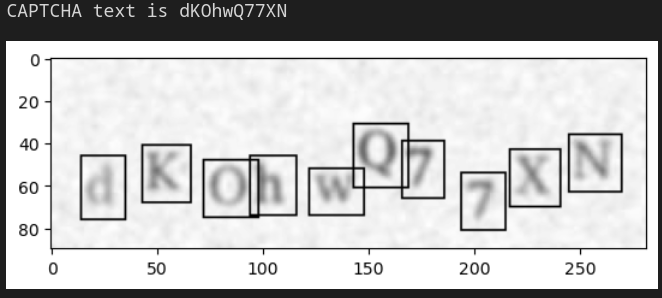
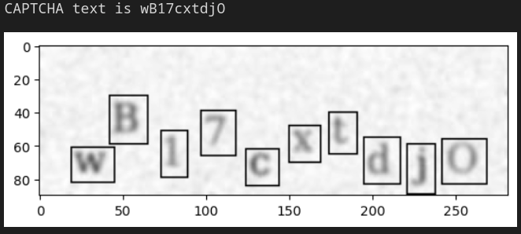
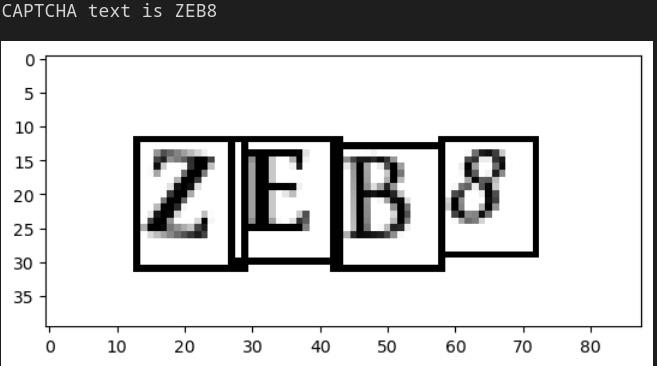
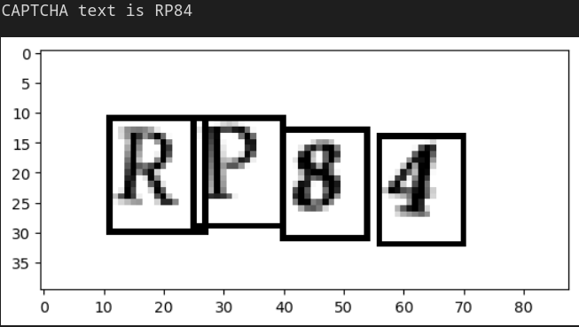

<h1> Captcha Solver </h1>

This projects is divided into 2 parts:
1. First, hard captcha images are preprocessed and then a CNN is trained to solve them.
2. Then, given a set of captcha images with lower level of difficulty, the previously trained model in harder to solve images is used as the feature extractor for the new simpler task. Transfer learning is use dand only the output layer is trained.

<h3> Datasets

- simple_captcha: really simple captcha
- hard_captcha: similar to the previous one, but with lower case letters

<h3> Image processing </h3>

Given the simplicity of the captcha images, the processing is done by extracting each character from the image using some data treatment and OpenCV. Then, each character is used to train a CNN.

<h3> How to run it </h3>

A detailed explanation of each step can be found on the file [demo.ipynb](src/demo.ipynb)
In this file several steps are performed:
1. Data preprocessing: Doing this will create two new folders with the extacted digits from both simple and harder captcha;
2. Two models are trained. One using the harder captcha data and the other the easier one.
3. For each task, the results are visualized and evaluated.
4. Transfer learning: The model that trained on the harder data is used as the backbone of a new model that is also going to be used to solve simple captcha.

<h2> Results </h2>

<h2> Contributions </h2>

Contributions are welcomed!
A lot can be improved in this repository. Some suggestions include:
- Defining a custom data generator to feed training and validation sets when fit method is called.
- Instead of cropping and saving each character from the images, it would be better to do it all in a preprocessing stage within a custom data generator.
- Improving the hard captcha preprocessing: adding new methods to detect each character.